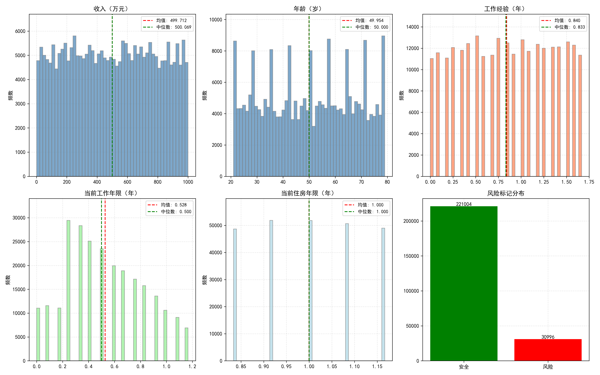
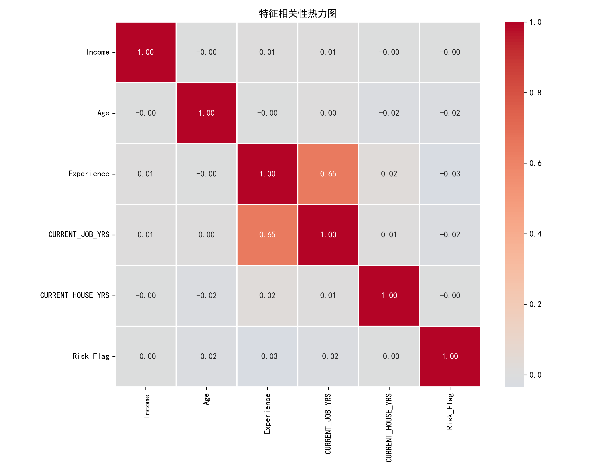
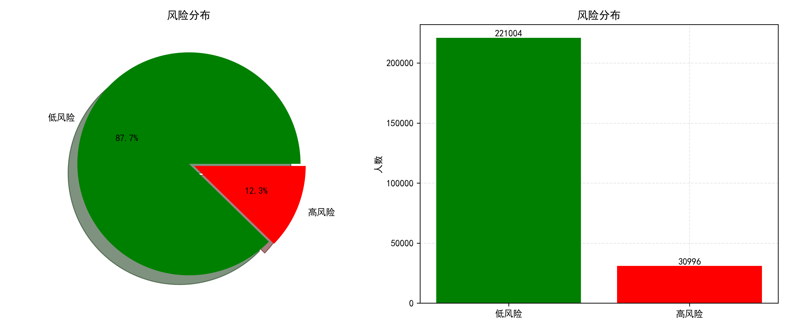
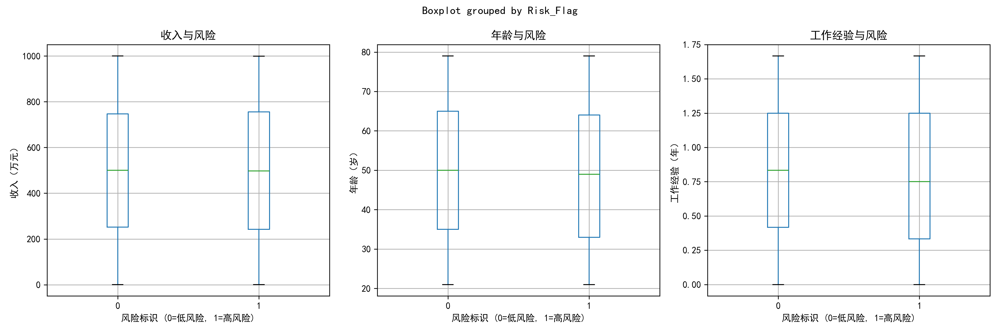

# 银行贷款违约风险预测分析

## 📋 项目简介
本项目基于银行贷款数据集，进行全面的探索性数据分析（EDA），识别影响贷款违约的关键因素，为风控决策提供数据支撑。

## 🎯 项目目标
- 分析贷款申请人的风险特征分布
- 识别与违约风险高度相关的因素
- 为后续机器学习建模提供特征工程方向

## 📊 数据集
- **来源**：Kaggle Loan Prediction Dataset
- **样本量**：252,000 条
- **特征数**：12 列
- **目标变量**：Risk_Flag（0=低风险，1=高风险）

## 🔧 技术栈
- Python 3.x
- Pandas / NumPy（数据处理）
- Matplotlib / Seaborn（可视化）
- Scipy（统计检验）

## 📈 分析流程
1. 数据加载与概览
2. 数据清洗（缺失值、重复值、异常值）
3. 单变量分析（数值型/分类型）
4. 多变量分析（相关性矩阵、热力图）
5. 目标变量分析（风险分布）
6. 特征与风险关系分析
7. 统计检验（卡方检验）

## 🔍 关键发现
- 高风险占比：**12.3%**（数据存在不平衡）
- 单身人群风险率比已婚人群高
- 租房人群风险率比自有住房人群高
- 无车人群风险率比有车人群高
- 收入、年龄与风险无显著线性关系

## 📊 可视化展示

| 数值列分布 | 相关性热力图 |
|:---:|:---:|
|  |  |

| 风险分布 | 特征与风险关系 |
|:---:|:---:|
|  |  |

## 📁 项目结构
Loan_Default_Prediction/
├── data/
│ └── Training Data.csv
├── scripts/
│ └── loan_analysis.py
├── images/
│ ├── 单变量分析图.png
│ ├── 相关性热力图.png
│ ├── 风险分布图.png
│ └── 特征与风险关系图.png
├── notebooks/
│ └── loan_analysis.ipynb
├── README.md
└── requirements.txt

## 🚀 如何运行
```bash
git clone https://github.com/luorirong/Loan_Default_Prediction.git
cd Loan_Default_Prediction
pip install -r requirements.txt
python scripts/loan_analysis.py
📝 后续计划
□ 使用 Logistic Regression 建立预测模型
□ 使用 Random Forest 进行特征重要性分析
□ 处理数据不平衡（SMOTE）
□ 模型评估与调优
📧 联系方式
 GitHub: https://github.com/luorirong
 Email: [rirong.luo@outlook.com]
## 📄 License
   MIT License
